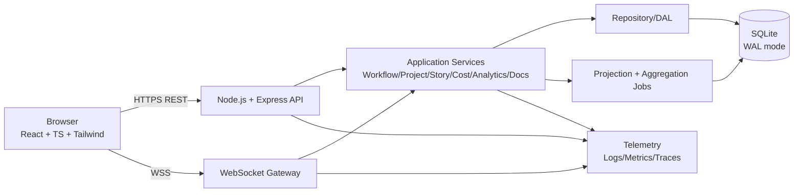
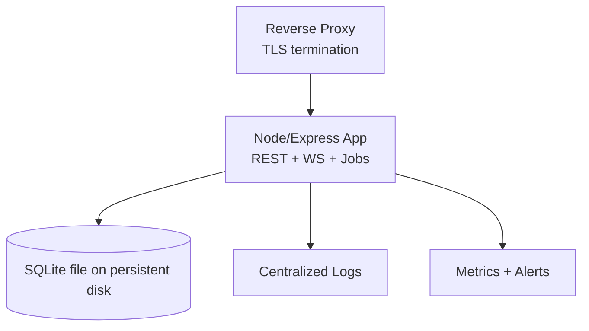

# BMAD Development Operations Dashboard - Technical Architecture

## 1. Overview

This document defines the MVP technical architecture for a unified, responsive web dashboard that consolidates workflow monitoring, project tracking, cost visibility, agent analytics, document viewing, and story Kanban with near real-time updates.

### 1.1 Goals
- Deliver a single operational cockpit with consistent cross-module state.
- Meet proposed freshness target: event-to-UI <= 3 seconds under normal load.
- Preserve trust via stale-state transparency, sync integrity checks, and lineage.
- Ship quickly on fixed stack while keeping a clean migration path beyond SQLite.

### 1.2 Fixed Constraints
- Frontend: React + TypeScript + Tailwind CSS
- Backend: Node.js + Express
- Database: SQLite
- Real-time: WebSocket
- MVP deployment: single Node/Express instance + SQLite

## 2. Architecture Decisions and Stack

## 2.1 Technology Stack

| Layer | Choice | Why this choice | Trade-offs |
|---|---|---|---|
| Frontend App | React + TypeScript | Strong component model and type safety for complex multi-module UI | Requires disciplined state boundaries to avoid over-coupling |
| Styling/Theming | Tailwind CSS + CSS variables | Fast UI delivery, strong dark/light parity control, responsive utilities | Can become hard to govern without design tokens |
| API Server | Node.js + Express | Fast MVP delivery, large ecosystem, simple REST + WS integration | CPU-heavy analytics must be bounded/cached |
| Real-time | `ws` WebSocket server (or equivalent) | Full duplex updates and explicit lifecycle control (heartbeat/reconnect) | Requires stale-state and replay logic for correctness |
| Database | SQLite (WAL mode) | Simple deployment, operationally lightweight for MVP | Write contention risk under bursty event ingestion |
| Data Access | Repository/DAL layer | Enables future DB migration with minimal service-layer change | Slight upfront abstraction cost |
| Background Jobs | In-process scheduler/queue | Enough for MVP sync checks and rollups without extra infra | Jobs share process resources with API/WS |
| Observability | OpenTelemetry (HTTP + WS spans), structured logs, Prometheus metrics | Enables SLA verification and incident diagnosis | Extra instrumentation work during MVP |

## 2.2 Guiding Architectural Patterns
- Modular monolith for MVP speed with explicit domain boundaries.
- Event-first state updates with canonical lifecycle vocabulary.
- Read models for dashboard queries; append-only event lineage for traceability.
- Clear separation between command path (writes) and projection path (read updates).

## 3. System Architecture

## 3.1 High-Level Diagram

## 3.2 Logical Components
- UI Shell: navigation, module layout, stale/sync indicators, theme persistence.
- Domain Services:
  - Workflow service
  - Project service
  - Story/Kanban service
  - Cost service
  - Agent analytics service
  - Document service
  - Sync integrity service
- Real-time event dispatcher: pushes normalized updates to subscribed clients.
- Projection engine: converts event stream into query-efficient module read models.
- DAL layer: only layer aware of SQLite-specific SQL.

## 4. Data Model and SQLite Schema

## 4.1 Canonical Lifecycle Vocabulary
Use a shared status enum across workflow/project/story with allowed subset per entity:
- `queued`, `in_progress`, `blocked`, `failed`, `done`, `canceled`

Status mapping from upstream systems must happen at ingestion boundary to prevent cross-view divergence.

## 4.2 Core Tables (MVP)

### Reference and identity
- `users` (`id`, `email`, `display_name`, `role`, `created_at`, `updated_at`)
- `agents` (`id`, `name`, `type`, `owner_team`, `created_at`)

### Operational entities
- `projects` (`id`, `name`, `owner_id`, `status`, `progress_pct`, `due_at`, `risk_flag`, `updated_at`)
- `stories` (`id`, `project_id`, `title`, `owner_id`, `status`, `kanban_column`, `updated_at`)
- `workflows` (`id`, `project_id`, `story_id`, `name`, `owner_id`, `status`, `last_transition_at`, `updated_at`)

### Event lineage
- `domain_events` (
  `id`, `event_type`, `entity_type`, `entity_id`, `project_id`, `story_id`, `workflow_id`,
  `occurred_at_utc`, `ingested_at_utc`, `source_system`, `correlation_id`, `payload_json`
  )
- `workflow_transitions` (`id`, `workflow_id`, `from_status`, `to_status`, `occurred_at_utc`, `actor_id`, `reason`)

### Cost and analytics
- `cost_events` (`id`, `project_id`, `workflow_id`, `agent_id`, `cost_amount`, `currency`, `occurred_at_utc`, `source_event_id`)
- `agent_metrics` (`id`, `agent_id`, `kpi_key`, `kpi_value`, `unit`, `window_start_utc`, `window_end_utc`, `lineage_ref`)
- `agent_outliers` (`id`, `agent_metric_id`, `score`, `method`, `flagged_at_utc`, `lineage_ref`)

### Documents
- `documents` (`id`, `project_id`, `story_id`, `title`, `mime_type`, `storage_path`, `checksum`, `created_at`)

### Sync/reliability
- `sync_state` (`id`, `module`, `last_successful_sync_at_utc`, `last_attempt_at_utc`, `status`, `error_message`)
- `client_sessions` (`id`, `user_id`, `connected_at_utc`, `last_heartbeat_at_utc`, `connection_state`, `last_ack_event_id`)

## 4.3 Indexing Strategy
- Composite indexes for time-window queries:
  - `domain_events(entity_type, entity_id, occurred_at_utc DESC)`
  - `cost_events(project_id, occurred_at_utc DESC)`
  - `agent_metrics(agent_id, kpi_key, window_end_utc DESC)`
- Realtime filters:
  - `workflows(status, last_transition_at DESC)`
  - `projects(status, due_at)`
  - `stories(kanban_column, updated_at DESC)`
- Integrity lookups:
  - `workflow_transitions(workflow_id, occurred_at_utc)`

## 4.4 SQLite Configuration
- Enable WAL mode (`PRAGMA journal_mode=WAL;`) for read/write concurrency.
- Use short transactions and batched inserts for events.
- Set busy timeout and retry in DAL for transient lock contention.

## 5. API Design

Base path: `/api/v1`

## 5.1 REST Endpoints

### Health and metadata
- `GET /health` -> liveness/readiness + DB health + websocket broker status
- `GET /meta/kpis` -> KPI definitions, units, directionality rules
- `GET /meta/status-model` -> canonical lifecycle vocabulary and allowed transitions

### Workflow Monitoring
- `GET /workflows?status=blocked,failed&ownerId=&projectId=&page=`
- `GET /workflows/:id`
- `GET /workflows/:id/transitions?limit=`

### Project Management
- `GET /projects?status=&ownerId=&riskFlag=&overdue=`
- `GET /projects/:id`
- `GET /projects/:id/context` (related stories, workflows, documents)

### Story / Kanban
- `GET /stories?projectId=&column=&status=`
- `GET /kanban/board?projectId=`
- `PATCH /stories/:id/status` (enabled only if editable mode decision is ON)

### Cost Tracking
- `GET /costs/summary?window=24h|7d|30d|custom&start=&end=&projectId=`
- `GET /costs/timeseries?bucket=hour|day&start=&end=&projectId=`

Rules:
- Invalid custom window returns `422` with field errors.
- Missing data returns `availability="unavailable"`, never coerced to zero.

### Agent Analytics
- `GET /analytics/agents/trends?agentIds=&kpis=&start=&end=`
- `GET /analytics/agents/outliers?agentIds=&kpi=&start=&end=`
- `GET /analytics/lineage/:lineageRef` -> source events/artifacts for drilldown

### Document Viewer
- `GET /documents?projectId=&storyId=`
- `GET /documents/:id` (metadata)
- `GET /documents/:id/content` (stream/renderable payload)

### Sync Integrity and stale indicators
- `GET /sync/status` -> module-wise last successful sync and failures

## 5.2 WebSocket Protocol

Endpoint: `wss://<host>/ws`

Client -> Server messages:
- `auth` `{ token }`
- `subscribe` `{ topics: ["workflow", "project", "story", "cost", "agent", "sync"] }`
- `heartbeat` `{ ts }`
- `resync_request` `{ lastAckEventId }`

Server -> Client messages:
- `snapshot` `{ module, version, data, generatedAt }`
- `event` `{ eventId, type, module, entityType, entityId, occurredAt, payload, lineageRef }`
- `stale_state` `{ module, isStale, lastSuccessfulUpdateAt, reason }`
- `sync_status` `{ module, status, lastSuccessfulSyncAt, error }`
- `error` `{ code, message, recoverable }`

Reliability protocol:
- Heartbeat interval: 15s, timeout after 2 missed heartbeats.
- Reconnect backoff: exponential with jitter, capped (e.g., max 30s, max 10 attempts before degraded mode).
- On reconnect: client sends `lastAckEventId`; server replays missing events or sends fresh `snapshot`.
- Stale indicator clears only after successful resync + fresh event receipt.

## 6. Frontend Architecture

## 6.1 Structure
- `AppShell`: global nav, stale/sync banners, theme toggle.
- Feature modules by route:
  - `/workflows`
  - `/projects`
  - `/costs`
  - `/analytics`
  - `/documents`
  - `/kanban`

## 6.2 State Management
- Server state via query cache (REST).
- Live overlay state via WebSocket event reducer.
- Conflict rule: newest `occurredAt` wins; if gap detected, trigger module resync.

## 6.3 Theming and Responsiveness
- Theme tokens in CSS variables with `data-theme="light|dark"`.
- Persist preference in `localStorage` + server profile when authenticated.
- Mobile-first breakpoints with overflow-safe tables, horizontal scroll regions, and stacked cards for narrow widths.

## 7. Authentication and Security

## 7.1 MVP Auth/RBAC Recommendation
- Minimum secure baseline: session or JWT authentication required for all API/WS routes.
- Roles:
  - `viewer`: read-only all modules
  - `operator`: read all + operational actions (future)
  - `manager`: read all + configuration-level actions (future)
- If Kanban editable mode enabled, enforce role-gated `PATCH /stories/:id/status`.

## 7.2 Security Controls
- HTTPS-only transport; secure cookies if session-based auth.
- Input validation at boundary (zod/joi schemas).
- Parameterized SQL via DAL to prevent SQL injection.
- CSP, XSS-safe rendering for documents, strict MIME handling.
- Audit trail for status changes and sensitive API calls.
- Rate limiting for auth and write endpoints.

## 7.3 Document Safety
- Allowlist MIME types for inline rendering (e.g., `text/markdown`, `application/pdf`, `application/json`).
- Unsupported formats return explicit fallback payload.
- Optional virus scanning hook for uploaded artifacts (if uploads introduced).

## 8. Deployment Architecture

## 8.1 MVP Topology (Single Instance)

- One container/service hosting REST, WS, and scheduled projection jobs.
- SQLite stored on persistent volume with backup schedule.
- Reverse proxy supports WebSocket upgrade and idle timeouts tuned for heartbeat.

## 8.2 Migration Path Beyond MVP
- Keep repository interfaces DB-agnostic.
- Introduce event broker (e.g., Redis/NATS) only when single-instance WS fanout becomes bottleneck.
- Move from SQLite to Postgres with unchanged service contracts:
  - same domain services
  - DAL implementation swap
  - migration scripts for schema/data

## 9. Third-Party Integrations

MVP: no deep external integrations by requirement.

Planned integration seams:
- Event ingestion adapters (BMAD runtime, project tooling).
- Identity provider adapter (OIDC/SAML) for future enterprise auth.
- Optional object storage adapter for documents.

## 10. Monitoring and Observability

## 10.1 Metrics (SLI/SLO aligned)
- `event_to_ui_latency_ms` (p50/p95/p99)
- `websocket_connected_sessions`
- `websocket_reconnect_attempts_total`
- `stale_state_active_sessions_ratio`
- `sync_failures_total{module}`
- `cross_view_consistency_failures_total`
- `api_request_duration_ms{route,status}`
- `sqlite_write_lock_wait_ms`

## 10.2 Logging
- Structured JSON logs with correlation IDs and event IDs.
- Include lineage references in analytics and outlier flows.
- Security logs for auth failures and privileged mutations.

## 10.3 Tracing
- Distributed trace spans across REST handlers, WS dispatch, DAL calls, projection jobs.
- Trace linkage from outlier drilldown to source events.

## 10.4 Alerts
- Freshness SLO breach (95th percentile > threshold).
- Elevated stale session ratio.
- Sync failure sustained > N minutes.
- SQLite lock contention above threshold.

## 11. Technical Risks and Mitigations

| Risk | Impact | Mitigation |
|---|---|---|
| WebSocket instability causes misleading UI | High | Heartbeat, bounded reconnect, mandatory resync before stale clear |
| Cross-module state divergence | High | Canonical status model, sync integrity checks, consistency monitor job |
| SQLite write contention under bursts | High | WAL mode, short tx, batch writes, indexed reads, backpressure and retries |
| Ambiguous KPI definitions | Medium/High | Freeze KPI catalog and lineage schema in Phase 0 |
| Scope creep (RBAC, editable Kanban, analytics depth) | High | Feature flags + decision gates + explicit non-goals |
| Unsupported document formats reduce usability | Medium | MIME allowlist + clear fallback UX + phased format support |

## 12. Assumptions and Open Decisions

## 12.1 Assumptions
- Moderate concurrency for MVP fits single instance + SQLite.
- Upstream systems emit sufficient identifiers/timestamps for lineage.
- Teams accept responsive web as sole MVP client.

## 12.2 Open Decisions (Must resolve in Phase 0)
- Final KPI list and definitions.
- Final freshness SLA/stale thresholds (1s vs 3s vs 5s).
- Auth/RBAC depth for MVP.
- Supported document formats for inline rendering.
- Kanban mode at launch: read-only vs editable.
- Data retention window (30/90/180 days).
- Capacity targets (concurrent users/workflows/events per minute).

## 13. Delivery Phasing (Architecture View)
- Phase 0: finalize glossary/SLA/KPIs/auth/doc formats/Kanban mode.
- Phase 1 (MVP): unified shell, real-time pipeline, consistency model, six modules, dark/responsive parity.
- Phase 2 (Hardening): load/perf validation, telemetry tuning, lineage audits, backup/restore drills.

## 14. Definition of Architecture Done (MVP)
- All module contracts documented and implemented.
- Cross-view status consistency checks running and visible in UI.
- WebSocket reconnect/heartbeat/resync behavior verified under failure tests.
- Observability dashboard shows freshness, reliability, and consistency SLIs.
- Security baseline (auth, validation, TLS, audit logging) active in all environments.
